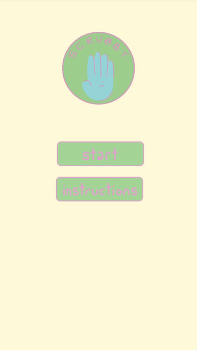
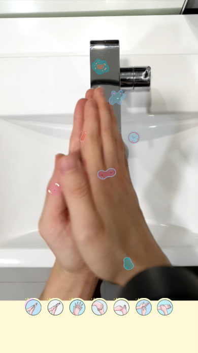
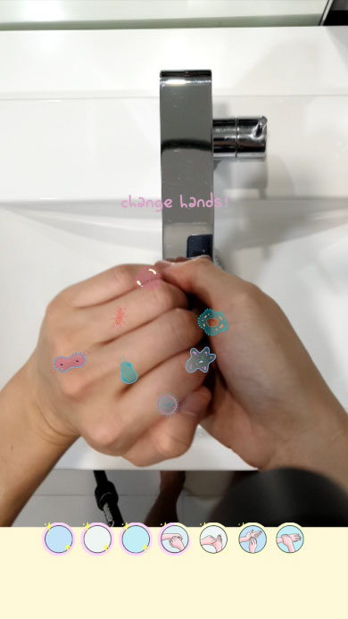

# Scrubby
Scrubby is an educational tool to teach children how to wash their hands well, at the same time encouraging this good habit to be carried out in the long run. 

All this will be done through a game with seven different levels to pass, each step allowing you to have progress in your level. A progress indicator will be present, corresponding to the steps. For instance, after completing the first step, the progress indicator will indicate so and you can move on to step two, in each circle, there will be graphics illustrated to prompt the kids on which action they should be completing. 

<h2>Scrubby Interface</h2>

     
     
    

